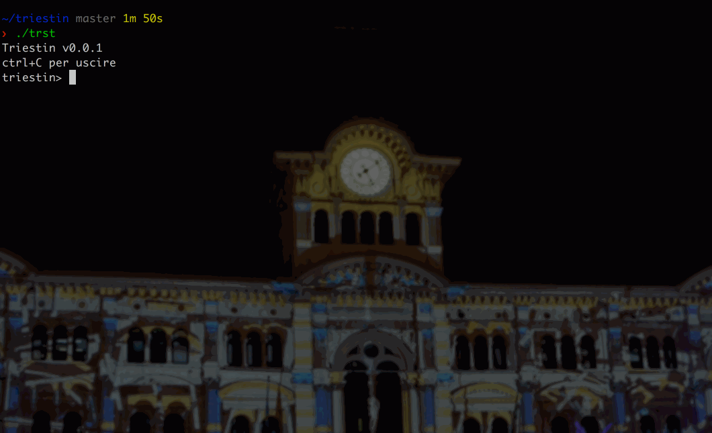

# `triestin`: A toy language for a small part of the world


`triestin` is a toy language, written and compiled in Python. `triestin` is also a [dialect](https://en.wikipedia.org/wiki/Triestine_dialect) from the northeastern corner of Italy, spoken by ~250,000 people.

Written by [Angela Ambroz](https://www.angelaambroz.com/blog/), as the final project for [CS50](https://cs50.harvard.edu/). I miei sono di [Gorizia](https://en.wikipedia.org/wiki/Gorizia).

## Installation

Well, for now, you can 	`git clone` this repo and, from the folder, run:

```{python}
cd /your/cloned/repo
chmod u+x trst
./trst
```

Which launches the REPL:


## Further reading

- [Blog post](http://angelaambroz.com/blog/posts/2018/May/30/introducing_triestin/)
- [_Joy of Programming_ Meetup slide deck](https://docs.google.com/presentation/d/1vuRte5qstacxVkHbhecGdGSjjUtCWLDNqBWlWCCPTN0/edit?usp=sharing)

## Resources
- [_Build Your Own Lisp_, Daniel Holden](http://www.buildyourownlisp.com/contents)
- [_A compiler from scratch_, Destroy All Software](https://www.destroyallsoftware.com/screencasts/catalog/a-compiler-from-scratch)
- [_A crash course in compilers_, Increment](https://increment.com/programming-languages/crash-course-in-compilers/)
- [_(How to Write a (Lisp) Interpreter (in Python))_, Peter Norvig](http://norvig.com/lispy.html)

## Credits
Photo: [wiki](https://commons.wikimedia.org/wiki/File:Frontemare_di_Trieste.jpg)
